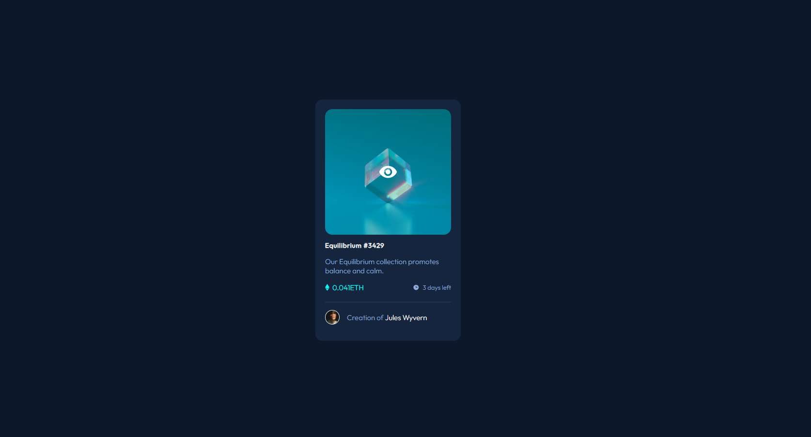

# Frontend Mentor - NFT preview card component solution

This is a solution to the [NFT preview card component challenge on Frontend Mentor](https://www.frontendmentor.io/challenges/nft-preview-card-component-SbdUL_w0U). Frontend Mentor challenges help you improve your coding skills by building realistic projects. 

## Table of contents

- [Overview](#overview)
  - [The challenge](#the-challenge)
  - [Screenshot](#screenshot)
  - [Links](#links)
- [My process](#my-process)
  - [Built with](#built-with)
  - [What I learned](#what-i-learned)
  - [Continued development](#continued-development)
  - [Useful resources](#useful-resources)
- [Author](#author)
- [Acknowledgments](#acknowledgments)

## Overview

NFT preview card component

### The challenge

Users should be able to:

- View the optimal layout depending on their device's screen size
- See hover states for interactive elements

### Screenshot



### Links

- Solution URL: [My solution URL here](https://www.frontendmentor.io/solutions/nft-preview-card-component-oQdTcK3eMS)
- Live Site URL: [My live site URL here](https://jayajo5.github.io/NFT-preview-card-component/)

## My process

I started by analyzing the provided design and breaking it into sections. The main structure consists of a container with a NFT preview card image and a text description.

### Built with

- Semantic HTML5 markup
- CSS custom properties
- Flexbox
- Mobile-first workflow

### What I learned

- I learned how to hover effect an image.

```html
 <div class="container">
    
    
    <div class="hover-img">
    
    </div>
```
```css
.container{
    height: 500px;
    width: 300px;
    background-color: hsl(216, 50%, 16%);
    border-radius: 15px;
    padding: 20px;
    position: relative;
}

.container .default-img{
    width: 100%;
    border-radius: 15px;
}

.container .hover-img{
    position: absolute;
    top: 20px;
    left: 20px;
    width: 260px;
    height: 260px;
    background-color: hsla(178, 100%, 50%, 0.377); 
    display: flex;
    justify-content: center;
    align-items: center;    
    border-radius: 15px;
    opacity: 0;
}

.container .hover-img:hover {
    opacity: 1;
    cursor: pointer;
}

.hover-img img{
    width: 40px;
    height: 40px;
}
```

### Continued development

- In future projects i want to learn more about CSS grid and flexbox method.

### Useful resources

- [CSS Tricks](https://css-tricks.com/centering-css-complete-guide/) - This helped me for Centering in CSS. I really liked this pattern and will use it going forward.
- [MDN Web Docs](https://developer.mozilla.org/en-US/docs/Glossary/Flexbox) - This is an amazing free resource which helped me finally understand Flexbox. I'd recommend it to anyone still learning this concept.

## Author

- GitHub - [@Jayajo5](https://github.com/Jayajo5)
- Frontend Mentor - [@Jayajo5](https://www.frontendmentor.io/profile/Jayajo5)

## Acknowledgments

A big thanks to the Frontend Mentor community for feedback and inspiration! 🚀